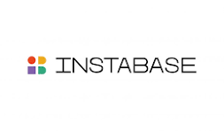

# AI-case-study
Instabase
!

## Overview and Origin

For many years the world operated on paper documents having to be physically signed and read to ensure completion and accuracy of data input. The recent trend in the world has been to move ever closer to a 'paperless' environment yet there is still so much real paper still in existence and in process of being transferred into digital content. Many companies have helped in the digitization of documents to make content availible in an easier to reach fashion for broader consumption for users. With this digital transformation has come a company started in 2015 by a student in an MIT PhD program. Anant Bhardwaj started Instabase Inc after getting guidance from his mentors at MIT to pursue different research projects. He then decided to drop out of the PhD program and pursue his passion for enabling business and process automation  

* Name of company
Instabase

* When was the company incorporated?
2015
* Who are the founders of the company?
Anant Bhardwaj

* How did the idea for the company (or project) come about?
he was encouraged while in PHd program at MIT to pursue different research projects

* How is the company funded? How much funding have they received?
Venture Capital investment support. in 2015 raised 3.75m. recently reported they have raised 105m with release of new AI hub platform
## Business Activities

* What specific problem is the company or project trying to solve?
process automation and ambigious data extraction

* Who is the company's intended customer? Is there any information about the market size of this set of customers?

* What solution does this company offer that their competitors do not or cannot offer? (What is the unfair advantage they utilize?)

* Which technologies are they currently using, and how are they implementing them? (This may take a little bit of sleuthing&mdash;you may want to search the company’s engineering blog or use sites like Stackshare to find this information.)

## Landscape

* What field is the company in?

* What have been the major trends and innovations of this field over the last 5&ndash;10 years?

* What are the other major companies in this field?

## Results

* What has been the business impact of this company so far?

* What are some of the core metrics that companies in this field use to measure success? How is your company performing based on these metrics?

* How is your company performing relative to competitors in the same field?

## Recommendations

* If you were to advise the company, what products or services would you suggest they offer? (This could be something that a competitor offers, or use your imagination!)

* Why do you think that offering this product or service would benefit the company?

* What technologies would this additional product or service utilize?

* Why are these technologies appropriate for your solution?

## Resources
https://instabase.com/
https://en.wikipedia.org/wiki/Instabase#:~:text=Instabase%20was%20founded%20by%20Anant,when%20he%20was%20a%20Ph
https://www.businesswire.com/news/home/20230607005256/en/Instabase-Doubles-Valuation-to-2B-and-Launches-AI-Hub-A-Generative-AI-Based-Platform-for-Content-Understanding
https://www.cbsnews.com/sanfrancisco/news/san-francisco-company-founder-says-ai-powered-platform-instabase-will-be-great-time-saver/
https://www.forbes.com/lists/americas-best-startup-employers/?sh=33f1e0e22ad7
